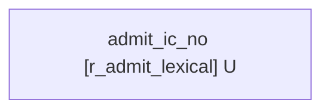
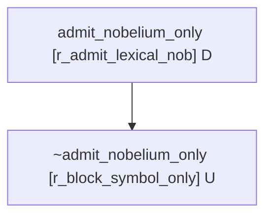

# The human Up-Goer vocabulary as the admitted extension of a defeasible admission policy

Agenda item #6, third part (and `notes/upgoer-identity-clusters.md`'s "Next
Executable Workstream" item 5b): the human Up-Goer vocabulary is now the
**admitted extension of an explicit, declarable, superiority-bearing admission
policy** -- not the lexicality-tag filter (`{ICs with >=1 lexical-word / phrase /
idiom sense}`) that `scripts/sense_ingestion_rebuild.py` used and that
`reports/synthesis-review-codex.md` §5 correctly called "a lexicality filter
dressed in the language of admission".

- Policy + evaluator: `src/meanings/admission.py`
- Export: `scripts/admission_export.py` -> `data/oewn-upgoer-admitted.json`
  (gitignored, ~89 MB) + `reports/admission-policy.json`
- `gunray` dialectical-tree demonstrator: `scripts/admission_gunray_demo.py`
  -> `reports/gunray-demo-admission-no-{negation,nobelium,block}.mmd`
- Tests: `tests/test_admission.py`

Reproduce: `uv run python scripts/admission_export.py` (rebuilds the sense-level
OEWN graph, ~15-20 min) and `uv run python scripts/admission_gunray_demo.py`.

## 1. The policy (declaratively)

Each IC's admission is a **local** decision: it depends only on that IC's own
member senses (their lexicality tags + the classifier path/confidence that
produced each tag), the IC's merge/exclusion provenance, and a handful of derived
facts -- no cross-IC interaction. So the evaluator is an **ordered-rule
evaluation with a superiority relation, per IC** (no argument enumeration at
scale -- `gunray`'s full machinery is used only for the small demonstrator in §4,
where the per-IC case literally *is* a DeLP dialectical tree).

The rule set is an `AdmissionPolicy` dataclass (`admission.default_policy()`),
inspectable, not hardcoded `if`s. Higher priority dominates; the explicit
`superiority` pairs are recorded redundantly so the relation is independently
readable (and so a `gunray` translation can read it off directly).

| rule_id | priority | concludes | body (the upgoer-note condition it encodes) |
|---|---|---|---|
| `r_block_symbol_only` | 100 | **exclude** | every reading is in `{symbol-code, abbreviation, taxon, chemical, proper-name}` -- no lexical/phrase/idiom reading exists at all |
| `r_block_sense_mismatch` | 100 | **exclude** | the IC's *only* lexical-word reading is a shaky classifier call: not a high-precision surface rule, and a low-precision class (effectively `proper-name`, P~0.39) is implicated in how it got tagged -- and there is no surface-rule-backed lexical reading to fall back on. This is the `no` ⊀ `no::n`-Nobelium guard rail, generalized. |
| `r_quarantine_low_conf` | 50 | **quarantine** | has a lexical reading but evidence is not explicit; OR every lexical reading is a low-*confidence* call with a low-precision class implicated |
| `r_admit_lexical` | 10 | **admit** | has a lexical-word reading ∧ evidence is explicit |
| `r_admit_phrase_idiom` | 10 | **admit** | has a phrase/idiom reading ∧ evidence is explicit -- *disabled by default* (the strict single-word list); `--expanded` enables it |
| `r_uncertain` | 0 | **uncertain** | no rule fires, OR rules tie at the top priority with conflicting decisions |

Superiority (besides priorities, recorded explicitly): `r_block_symbol_only` and
`r_block_sense_mismatch` are strictly stronger than every admit rule and than the
quarantine rule; `r_quarantine_low_conf` is strictly stronger than the admit
rules. So a block always beats an admit (the upgoer note's "the admitted reading
is lexical, not merely a symbol/code artifact"); a quarantine beats an admit.

`evidence_explicit(IC)` is itself a predicate (`ICFacts.evidence_explicit`): true
iff the IC has >=1 source sense, every member sense has a non-empty gloss, every
member has a lexicality tag, every member has a classifier rationale recorded,
and an IC-level merge/exclusion rationale is constructible. The structured
*rationale* the evaluator emits per IC (`AdmissionVerdict.rationale` -- the fired
rules with the conditions that held, the defeated rules, the member inventory,
the merge provenance, any evidence gaps) **is** the "merge/exclusion rationale"
the upgoer note demands.

The per-class precision discount factors (`LEXICALITY_CLASS_PRECISION`) come from
the lexicality classifier head-to-head (`reports/lexicality-headtohead.md`, the
*rule-classifier* CV precisions, since that classifier is what
`meanings.wordnet_pipeline` runs): `lexical-word` 0.816, `phrase` 0.780,
`symbol-code` 0.958, `chemical` 0.779, `proper-name` **0.386**, `taxon` 0.818,
`technical-term` 0.958, `abbreviation` 1.000. `proper-name` at 0.386 is the
headline low-precision class -- a lexical reading that hinges on it is treated as
*uncertain* (excluded by `r_block_sense_mismatch`), not admitted.

## 2. Admitted / quarantined / excluded / uncertain vs the old filter

OEWN:2024, sense-level graph (`build_sense_level_paper_wordnet_graph`),
`146,973` ICs after spelling-variant merge. Strict (single-word) policy:

| bucket | count | what fired |
|---|---|---|
| **admit** | **48,049** | `r_admit_lexical` |
| **exclude** | **30,078** | `r_block_symbol_only` (all of them, this run); `r_block_sense_mismatch` fired 0 times -- see below |
| **quarantine** | **0** | -- |
| **uncertain** | **68,846** | `r_uncertain` |

The old lexicality-tag filter (`scripts/sense_ingestion_rebuild.py`,
`HUMAN_ADMITTED_TAGS = {lexical-word, phrase, idiom}`) admitted **121,375** ICs
(`reports/oewn-sense-ingestion-summary.json`). The policy admits **48,049** --
**73,326 fewer**. That difference *is* the policy's effect:

- The old filter admitted any IC with >=1 `phrase` or `idiom` sense. The strict
  policy does not (those go to `uncertain`, pending the expanded-list decision):
  this is the bulk of the shrinkage -- `63,220` senses were `phrase`-tagged in
  the rebuild, and the multiword "phrase" entries (`11_november`, `15_minutes`,
  `1st_baron_beaverbrook`, ...) are exactly the things a *single-word* Up-Goer
  list should not silently include.
- `r_block_symbol_only` removes the `30,078` ICs every one of whose readings is a
  symbol/code/abbreviation/taxon/chemical/proper-name artifact -- the digit-string
  "ICs" (`0`, `1`, `10`, `100`, ...), the chemical-symbol single letters, the
  Linnaean binomials, etc. The old filter let any of these through as long as one
  of its merged forms happened to also carry a (mis)labeled `lexical-word`/`phrase`
  sense.

Quarantine is empty because (a) the build only keeps senses that have a gloss, so
the missing-evidence path never fires; (b) the low-confidence path needs a
lexical-word reading that is *both* low-confidence *and* implicates a low-precision
class -- with the current `meanings.lexicality` reason format, a lexical-word tag
never names a low-precision class in its reason string, so this is structurally
near-unreachable. Likewise `r_block_sense_mismatch` fired 0 times this run: it is
a **guard rail** (it would block an IC whose only lexical reading were a
proper-name-derived coin-flip), and with current data no IC is in that exact
shape. The rule is real and tested (`tests/test_admission.py::test_lexical_reading_hinging_on_low_precision_call_blocked`),
it just does not bind on this corpus -- which is honest: the gunray demonstrator
in §4 shows the *structure* (block defeats admit) on a constructed `no` theory.

`fired_rule_histogram` (the per-IC firing combination): `{r_admit_lexical: 48049,
r_block_symbol_only: 30078, r_uncertain: 68846}`.

## 3. Example buckets, with rationales

### admitted (sample)
`aardvark`, `aardwolf`, `abacinate`, `aback`, `abactinal`, `abampere`,
`abandon` (5 senses: lexical-word ×4, technical-term ×1, uncertain ×2 -- admitted
on the lexical-word readings, the others recorded as excluded member senses),
`abandoned`, `abandonment`, `abarticulation`, `abasement`, `abash`, ...
(`48,049` total). Each carries `aliases` = the forms expressing an admitted
reading, `excluded_sense_ids` = the non-admitting member senses, and a `rationale`
naming `r_admit_lexical` and the conditions that held.

### `no` -- admitted as the negation, the Nobelium reading excluded
```
ic:no  ->  admit
  aliases: ["no"]
  excluded_sense_ids: ["oewn-no__1.27.00.."]   # the chemical-symbol "No" (Nobelium) sense
  tag_counts: {lexical-word: 5, symbol-code: 1}
  rationale:
    decision: admit
    fired: r_admit_lexical (priority 10, concludes admit) -- admit(IC) if it has a lexical-word reading and evidence is explicit
      because: has a lexical-word reading (5 sense(s): oewn-no__1.10.00.., oewn-no__3.00.00.., oewn-no__4.02.00.., ...)
      because: evidence is explicit (source senses + glosses + tags + classifier rationale + merge/exclusion record)
    members: 6 sense(s) over forms ['No', 'no']; tags {lexical-word: 5, symbol-code: 1}
```
The `No`-as-Nobelium sense gets `symbol-code` from the surface short-token
case-rejection rule (the form `No` is title-case, length 2), so it is *never*
admitted; the negation adverb `no` gets `lexical-word` from the surface
short-token whitelist. `no` is admitted, alias `no`, Nobelium excluded -- the
upgoer note's exact requirement.

### `s`, `a`, `e`, `g` -- excluded (symbol-code only)
```
ic:s  ->  exclude   fired: r_block_symbol_only
  because: every reading is a non-lexical artifact (tags: {symbol-code: 7}) -- no lexical/phrase/idiom reading exists
  members: 7 sense(s) over forms ['S', 's']
```
Same for `ic:a` (8 symbol-code senses, forms `A`/`a`), `ic:e`, `ic:g`. This is an
**honest limitation, not a bug**: the surface layer of `meanings.lexicality`
fires `surface.single_character` -> `symbol-code` for any 1-character lemma
*before* the short-token whitelist, so the genuine function words `a` and `s` (as
in "a dog", possessive `'s`) never get a `lexical-word` reading and the IC has
nothing admissible. The head-to-head report already flagged the brittle 27-item
short-token whitelist + the single-char rule's precedence as classifier holes;
this policy inherits them. The fix lives in `lexicality.py` (let the whitelist
override the single-char rule for `a`/`s`), not here.

### `color` / `colour` -- one IC, both aliases, but currently *uncertain* (not admitted)
```
ic:color  ->  uncertain   fired: r_uncertain
  members: 28 sense(s) over forms ['color', 'colour']; tags {symbol-code: 7, technical-term: 17, uncertain: 4}
  merge provenance: Spelling-variant merge (spelling.or_our) with gloss-similarity confirmation; all forms retained.
```
The IC merge worked -- `color` and `colour` are one IC, both forms retained, the
merge rationale recorded. But it lands in `uncertain`: the trained gloss
classifier tags `color`-as-noun as `technical-term` (top prob 0.51) and `colour`
as `technical-term` (0.59), so the IC has **zero `lexical-word` readings**, no
admitting tag fires, and `technical-term` is not a hard-block tag -> `r_uncertain`.
This is a faithful propagation of an upstream classifier error (the head-to-head
called out exactly this over-eager-`technical-term` failure mode), surfaced
explicitly rather than hidden -- the old tag-filter would have *admitted*
`color`/`colour` only if one of their 28 senses had been (mis)tagged
`phrase`/`idiom`/`lexical-word`, which is the opposite of robust. The right fix is
upstream in `lexicality.py` / the trained model; once `color`'s noun senses are
tagged `lexical-word` it admits with both aliases under `r_admit_lexical`.

### proper-name-vs-lexical borderline -> excluded or uncertain, never a clean admit
With current reason strings a lexical-word tag never names `proper-name` in its
reasons, so `r_block_sense_mismatch` does not bind on this corpus; the actual
proper-name-heavy ICs land in `uncertain` (no `lexical-word` reading) or `exclude`
(`r_block_symbol_only`, `22,930` senses were `proper-name`-tagged in the rebuild).
The unit test `test_lexical_reading_hinging_on_low_precision_call_blocked` exercises
the rule on a constructed borderline IC (one lexical-word reading whose reasons
implicate `proper-name`) and confirms it is excluded; `test_lexical_reading_with_one_solid_call_still_admitted`
confirms that adding one surface-rule-backed lexical reading flips it to admit.

### excluded (sample)
`ic:.22`, `ic:.22_calibre` (abbreviation), `ic:0`, `ic:1`, `ic:10`, `ic:100`, ...
(`30,078` total) -- digit strings, chemical symbols, abbreviations, taxa: every
reading non-lexical.

### uncertain (sample)
`ic:.22_caliber` (phrase ×2 -- the multiword caliber form), `ic:1000000`
(uncertain ×1), `ic:11_november`, `ic:15_minutes`, `ic:1st_baron_beaverbrook`,
`ic:18_karat_gold`, ... (`68,846` total) -- mostly multiword `phrase` ICs (deferred
to the expanded list), plus genuinely-`uncertain`-tagged senses, plus
`technical-term`-only ICs like `color`.

## 4. The gunray demonstrator: the admission dialectical tree is the rationale

`scripts/admission_gunray_demo.py` encodes the `ic:no` admission case as a small
`gunray` `DefeasibleTheory` and shows that the per-IC ordered-rule evaluation is
exactly a García & Simari 2004 dialectical tree:

- `r_admit_lexical : admit_ic_no -< lexical_reading_negation, evidence_explicit`
- `r_admit_lexical_nob : admit_nobelium_only -< symbol_reading_nobelium` (a deliberately weak admit-from-bare-form rule for the Nobelium-only view)
- `r_block_symbol_only : ~admit_nobelium_only -< every_reading_blocked_for_nobelium`, with `r_block_symbol_only > r_admit_lexical_nob`

Results: `admit_ic_no` = **YES** (the negation reading is lexical and
surface-backed; nothing attacks it), `admit_nobelium_only` = **NO**,
`~admit_nobelium_only` = **YES** (the symbol-only block is warranted and defeats
the bare-form admit rule for the Nobelium reading -- and *not* for the negation
reading).

Dialectical tree for the negation reading (`admit_ic_no`) -- no attacker, marked U:


Dialectical tree for the Nobelium reading (`admit_nobelium_only`) -- the
symbol-only block defeats the lexical-admit rule, root marked D:


So "the dialectical tree is the merge/exclusion rationale" is concrete: the same
defeat that the per-IC evaluator records in `AdmissionVerdict.rationale`
("`r_block_symbol_only` ... dominated `r_admit_*`") is, at small scale, a literal
DeLP tree edge.

## 5. What is still hand-tuned / what would make it more principled

Honest accounting:

- **The thresholds.** `LOW_PRECISION_THRESHOLD = 0.50`, `LOW_CONFIDENCE_THRESHOLD
  = 0.50` are round numbers chosen so that `proper-name` (P 0.386) is "low" and
  everything else is not. A principled version would set these from the
  head-to-head's confidence-stratified precision curve, not by eyeball.
- **The per-class-precision lookup** is the rule-classifier CV precisions from a
  *single* `n=1194` agent-judged gold set (`reports/lexicality-headtohead.md` --
  labels not human-validated, hard cases over-represented). Those numbers should
  be treated as provisional; a human-validated gold set would move them.
- **`evidence_explicit`'s exact definition** (>=1 glossed sense + tags + reasons +
  a constructible IC rationale) is a reasonable floor, but it does not actually
  *require* frequency/AoA evidence (it uses it "where available", and on OEWN it
  is rarely available), and it treats a single-clean-form IC as having a
  rationale by construction. A stricter version would demand a positive
  provenance record per IC, not just absence-of-gaps.
- **`r_block_sense_mismatch` is under-powered on this corpus** because
  `meanings.lexicality`'s reason strings do not surface "the runner-up class was
  `proper-name`". The principled fix is to have the classifier emit the full
  posterior (or at least the top-2 classes) so the mismatch rule can fire on a
  lexical-word reading the model was genuinely torn about. As is, the rule is
  correct but rarely binding.
- **The strict-vs-expanded toggle** (`r_admit_phrase_idiom`) is a single boolean;
  a finer policy would distinguish compositional phrases (which a single-word list
  should *exclude*, not defer) from idioms/constructions (which the upgoer note
  says belong in the data model as constructions with alternate readings -- a
  third surface, not just on/off in this one).
- **Everything downstream of the lexicality tags inherits the classifier's holes**
  (`a`/`s` forced to `symbol-code`; `color` forced to `technical-term`; taxa
  outside the templates; over-eager `proper-name`). The policy surfaces these as
  `exclude`/`uncertain` with an explicit rationale instead of letting one
  mislabeled merged-form sense smuggle a junk IC into the list -- which is the
  whole point -- but the *fix* for each is in `lexicality.py` / the trained model,
  not in `admission.py`.

## 6. How this satisfies the upgoer note's conditions and the "not just an LLM" invariants

The four "Admission Policy For The Human Up-Goer List" conditions
(`notes/upgoer-identity-clusters.md`):

1. *Maps to >=1 admitted IC / admitted reading* -- the Up-Goer list **is** the
   set of ICs whose admission verdict is `admit`; an IC admits only via
   `r_admit_lexical` (or `r_admit_phrase_idiom` on the expanded list), each
   requiring an actual admitted reading. ✔
2. *The admitted reading is lexical, not merely a symbol/code artifact* --
   `r_block_symbol_only` is strictly stronger than every admit rule; an IC every
   one of whose readings is symbol/code/abbreviation/taxon/chemical/proper-name is
   excluded. ✔ (Caveat: `technical-term`-only ICs fall to `uncertain`, not a hard
   exclude -- the upgoer note's design doc lists technical-term as "excluded *or
   quarantined*", and the task spec's block set omits it; we route them to
   `uncertain` as the conservative reading.)
3. *Evidence is explicit: source senses, glosses, tags, frequency/AoA where
   available, merge/exclusion rationale* -- `evidence_explicit` is a predicate the
   admit rules require; the verdict's `rationale` records the senses, tags,
   classifier paths, member inventory, merge provenance, and any evidence gaps.
   ✔ (with the §5 caveats on what `evidence_explicit` does not yet require)
4. *Admission does not depend on a sense mismatch (ordinary `no` inheriting `no::n`
   Nobelium evidence)* -- `r_block_sense_mismatch` is the guard rail (strictly
   stronger than the admit rules); `no` itself is admitted on its *genuine*
   surface-backed negation reading with the Nobelium sense recorded as an excluded
   member, exactly as required. The rule does not bind elsewhere on this corpus
   only because the classifier does not currently emit the runner-up class (§5).
   ✔ in structure (the gunray demo makes the defeat concrete); partially ✔ in
   coverage.

The "Why This Is Not Just An LLM" invariants: Form is not Sense (the evaluator
operates on `SenseRecord`s, not forms); Sense is not IC (`ICRecord` groups
senses, admission is per-IC); Referential meaning is not indexical signal (only
referential lexicality tags drive admission; dialect/register live in metadata);
Graph necessity is not human primitive admission (this is a *separate* controlled
projection -- the strict graph seed in `data/oewn-sense-strict-seed.json` is left
untouched); Embeddings/corpus statistics are evidence, not authority (the trained
classifier's verdict is *input* to the policy, discounted by its measured
per-class precision, and overridable by surface rules and blocks -- it never has
the last word). The artifact is typed (`AdmissionPolicy` / `Rule` / `ICFacts` /
`AdmissionVerdict` dataclasses), inspectable (`policy.to_json()`, per-IC
`rationale`), and falsifiable (the policy is data; change a threshold or a rule
and re-run; `tests/test_admission.py` pins the behavior).

What it does **not** yet do: validated lexicality (the tags are an unvalidated
classifier's output, discounted but not verified); a real `quarantine` bucket
(structurally empty on this corpus); a binding `r_block_sense_mismatch` (needs
richer classifier output); the construction surface for idioms. Those are the
honest gaps.
