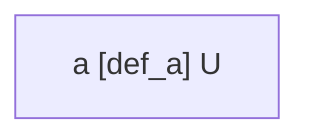
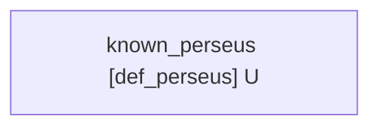
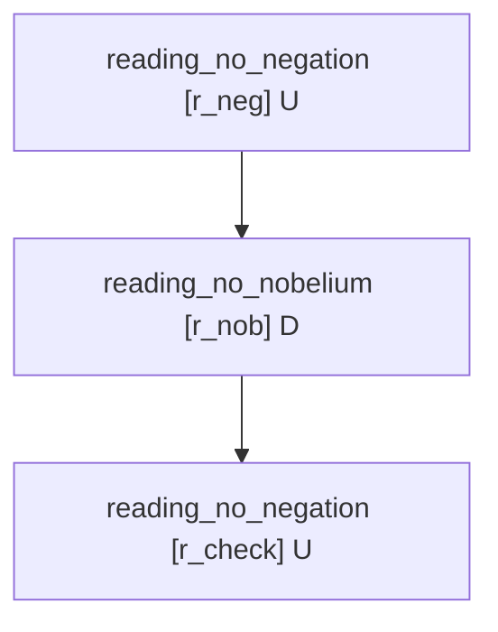

# gunray grounding demo — recursive definability is not meaning, mechanized

**Date:** 2026-05-12
**Connection:** #5 from `reports/sibling-tools-connection.md` ("polysemy / WSD = defeasible reasoning"; the `UNDECIDED` circular-core demonstrator). See also §7 (the typed-defeasible ingestion layer) of that report.
**Code:** `scripts/gunray_grounding_demo.py` — runnable with `uv run python scripts/gunray_grounding_demo.py`.
**Dependency:** `gunray` pinned to `git+https://github.com/ctoth/gunray@df4580e1f4c3671159e057ade6d1411512196808` (a real git pin; `import gunray` confirmed working under `uv run`). Zero-dep MIT DeLP engine (García & Simari 2004).
**Renders written:** `reports/gunray-demo-toy-a-grounded.mmd`, `reports/gunray-demo-oewn-perseus-grounded.mmd`, `reports/gunray-demo-polysemy-no.mmd` (the ungrounded OEWN tree has *no argument at all* — that absence is the `UNDECIDED` signature, so there is nothing to render).

## What this demonstrates

The meanings repo studies *what a word means when the structure that should fix its meaning is circular and the answer is underdetermined*, with graph theory (SCCs, feedback vertex sets, the Kernel). `gunray` is a defeasible-logic engine whose four-valued answer (`YES`/`NO`/`UNDECIDED`/`UNKNOWN`) makes "the circular core has no determinate answer" a *first-class outcome*, not an error or an arbitrary tie-break. Putting the two together gives a working formal analogue of the grounding thesis:

- an **un-grounded circular definition core ⇒ `UNDECIDED`** (this is the Kernel: an ungrounded mutually-referential loop);
- **supply a minimal grounding set** — a feedback-vertex-set hitting every cycle, computed by `meanings.minset` — **and every dependent literal flips to `YES`** (the Satellites become derivable by recursive unfolding);
- the **dialectical tree `gunray` builds is the merge/exclusion rationale** — renderable before and after.

And, separately: **polysemy is defeasible reasoning** — competing readings of a surface form attack each other, a typed-evidence argument defeats the wrong reading, the accepted extension is the disambiguated sense, and the tree shows *why*.

This is Harnad's point ("recursive definability ≠ meaning; you need grounding") mechanized in ~250 lines of working code.

---

## Part 1 — toy circular core: `a -< b`, `b -< a`, no facts → `UNDECIDED`

```
rules: def_a: a -< b ;  def_b: b -< a ;  facts: (none)
answers: {'a': 'UNDECIDED', 'b': 'UNDECIDED'}
build_arguments produced: (empty)
```

Both `a` and `b` come out `UNDECIDED` — **not** an error, **not** an arbitrary winner, **not** `UNKNOWN` (the predicates *are* in the rule language). `build_arguments` constructs minimal supports bottom-up from the strict closure of the facts; with no facts that closure is empty, the loop never makes progress, so no argument for either literal is ever built. No argument → not warranted → and since the predicate is in the language → `UNDECIDED`. This is the Kernel reduced to its essence: an ungrounded circular core.

## Part 2 — add one grounding fact (`b`) → `b` `YES`, `a` resolves to `YES`

```
rules: def_a: a -< b ;  def_b: b -< a ;  facts: b
answers: {'a': 'YES', 'b': 'YES'}
```

Dialectical tree for `a` after grounding:



`b` is `YES` because it is a fact; `a` is `YES` because `def_a` fires off the now-grounded `b`. One external grounding fact dissolves the whole loop. This is "choose a minimal grounding set; the Satellites become derivable" in two lines of theory — and the (here trivial) dialectical tree is the rationale: a single unattacked argument, marked `U`.

---

## Part 3 — a real OEWN Kernel SCC: a 9-word circular mythology cluster

The slice is the **smallest cyclic strongly-connected component** of the OEWN:2024 *lemma-level* Kernel (25,185 nodes; the Kernel is the part of the 151,622-node definition graph that survives leaf-stripping, i.e. everything that participates in or depends on a cycle). It is a self-contained Greek-mythology loop — every word's WordNet gloss is "defined" using other words in the set, with no exit to grounded vocabulary:

| word | gloss mentions (within the SCC) |
|---|---|
| `andromeda` | andromeda, andromeda_galaxy, cassiopeia, perseus |
| `andromeda_galaxy` | andromeda |
| `bellerophon` | pegasus |
| `cassiopeia` | andromeda, cepheus, perseus |
| `cepheus` | cassiopeia |
| `coelenterate` | medusa |
| `medusa` | coelenterate, pegasus, perseus |
| `pegasus` | andromeda, bellerophon |
| `perseus` | andromeda, medusa |

(Sample glosses: *perseus* — "(Greek mythology) the son of Zeus who slew Medusa … and rescued Andromeda from a sea monster"; *medusa* — "… a woman transformed into a Gorgon by Athena; she was slain by Perseus"; *pegasus* — "… the immortal winged horse that sprang from the blood of the slain Medusa; was tamed by Bellerophon …". `coelenterate` is in the loop because the *jellyfish* sense of "medusa" is a coelenterate, and "coelenterate" 's gloss reaches back.)

Each word becomes a 0-ary defeasible rule `known_w -< known_u1, known_u2, …` over its definiens (self-loops, a gloss artifact, dropped from the body — the cycle through *other* nodes is what carries the circularity). The local feedback-vertex-set is computed by `meanings.minset.solve_minset(...)`.

### Ungrounded (no facts)

```
known_andromeda              UNDECIDED
known_andromeda_galaxy       UNDECIDED
known_bellerophon            UNDECIDED
known_cassiopeia             UNDECIDED
known_cepheus                UNDECIDED
known_coelenterate           UNDECIDED
known_medusa                 UNDECIDED
known_pegasus                UNDECIDED
known_perseus                UNDECIDED
```

Every word `UNDECIDED`. The dialectical tree for `known_perseus` is **empty — no argument exists** (the recursive support never bottoms out). That absence *is* the `UNDECIDED` verdict. Nothing to render; the lack of a tree is the diagnosis.

### Local feedback-vertex-set (the minimal grounding)

```
FVS = ['andromeda', 'cepheus', 'medusa', 'pegasus']   (residual cyclic SCCs after removal: 0)
```

Removing those four words from the digraph makes it acyclic — so fixing those four "from outside" (e.g. by ostension, or because they are in a more-foundational vocabulary) is exactly enough that recursive unfolding determines every other word in the slice. This is Massé's minimal-grounding-set, computed here on real OEWN data, then fed back in as `gunray` facts.

### Grounded (facts: the four FVS atoms given)

```
known_andromeda              YES  <- flipped
known_andromeda_galaxy       YES  <- flipped
known_bellerophon            YES  <- flipped
known_cassiopeia             YES  <- flipped
known_cepheus                YES  <- flipped
known_coelenterate           YES  <- flipped
known_medusa                 YES  <- flipped
known_pegasus                YES  <- flipped
known_perseus                YES  <- flipped
```

9/9 words flip `UNDECIDED → YES`. The four FVS members are `YES` because they are now facts; the five satellites — `andromeda_galaxy`, `bellerophon`, `cassiopeia`, `coelenterate`, `perseus` — are `YES` **purely by derivation** (e.g. `known_perseus` follows from `known_andromeda` and `known_medusa`, both grounded). Dialectical tree for `known_perseus` after grounding:



A single unattacked argument, marked `U` — `perseus` is warranted. **The `UNDECIDED → YES` flip works exactly as described.**

---

## Part 4 — polysemy: "no" reads as negation, not Nobelium

The surface form **"no"** has (at least) two WordNet readings: the function word (negation) and the chemical symbol **No** for Nobelium. In context, one wins. That's defeasible:

```
r_neg   : reading_no_negation -< form_no
r_nob   : reading_no_nobelium -< form_no
r_check : reading_no_negation -< form_no, gloss_is_function_word_no
superiority: r_check > r_nob
conflict:    reading_no_negation  ><  reading_no_nobelium
facts: form_no, gloss_is_function_word_no
```

`r_neg` and `r_nob` are the two bare readings; `r_check` is a *type-check argument* — it concludes the negation reading from a stronger antecedent (the gloss looks like a function-word gloss, not a chemical-element gloss), and an explicit superiority makes `r_check` beat `r_nob`. Because the two readings are declared mutually exclusive (`conflicts`), warranting one defeats the other.

```
answers: {'reading_no_negation': 'YES', 'reading_no_nobelium': 'UNDECIDED'}
```

Dialectical tree for `reading_no_negation`:



Reading: the root argument for `reading_no_negation` (`[r_neg]`, marked `U`) is attacked by the Nobelium reading (`[r_nob]`), which is in turn defeated by the type-check argument (`[r_check]`, leaf, `U`) — so `[r_nob]` is marked `D`, the root stands, `reading_no_negation` is warranted (`YES`) and `reading_no_nobelium` collapses to `UNDECIDED`. **The tree is the merge/exclusion rationale** the admission policy in §7 of the connections report wants — a literal "here is why the Nobelium reading was excluded."

---

## What did not get done / caveats

- **0-ary encoding, not `known(w)/1`.** With variable predicates and an empty Herbrand universe `gunray` grounds to nothing and (correctly, by its own semantics) reports `UNKNOWN`, not `UNDECIDED`. So the OEWN slice is encoded with one 0-ary propositional atom per word (`known_perseus`, not `known(perseus)`). Likewise Part 4 uses `reading_no_negation` not `reading(no, negation)` — a bare lowercase identifier in term position parses as a Datalog variable in `gunray`'s surface syntax. This is a faithful encoding for the demonstrator; a scaled version would want a constants-based encoding plus seed facts to populate the universe.
- **The OEWN slice is small by construction.** `gunray`'s argument enumeration is brute-force; this is a demonstrator on a 9-node SCC, not a path to evaluating the 25k-node Kernel. The meanings repo's own SCC/FVS machinery is what scales; `gunray` supplies the *semantics* and the *explanation*, on small sub-theories.
- **Building the OEWN graph took ~10 min** (one-time; `wn` caches it). The selected SCC and its adjacency are hard-coded in the script (with a comment recording provenance) so the demo runs in seconds; re-deriving it is a separate `build_lemma_graph` + `compute_kernel` pass.
- **Part 4's superiority is global, not context-conditional.** `gunray`'s `superiority` field is unconditional over rule ids. Modeling "the type check beats the bare reading *only when the gloss-type evidence is present*" is done here by putting that evidence in `r_check`'s body — so `r_check` simply doesn't fire without it. A context-parameterized version would lean on generalized specificity instead.
- The two-cycle "two MinSets, neither privileged" case (ground `a` *or* ground `b`) is implicit in Part 1–2 (grounding `a` instead of `b` works symmetrically) but not shown as a separate stanza; it folds naturally into the connections-report narrative.

## Bottom line

`UNDECIDED → YES` on grounding works as described, in both the toy core and a real OEWN Kernel SCC. The polysemy case resolves to the right reading with the dialectical tree as the rationale. `gunray` is a faithful, zero-dependency home for the "the Kernel is the ungrounded circular core; a feedback-vertex-set is the minimal grounding; the rest is derivable" thesis — at demonstrator scale, complementary to the repo's own graph machinery, which is what would make any of it scale.
